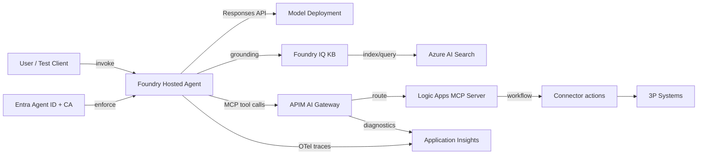

# Azure AI Foundry — Ignite 2025 Demo (End-to-End, Proof-Driven)

[-111827)](#)

This repo is a hands-on demo that showcases the most important **new capabilities announced at Microsoft Ignite 2025** for building, running, and governing AI agents with **Azure AI Foundry**—with an emphasis on **enterprise-proof** outcomes: identity enforcement, traceability, knowledge grounding, tool governance, and workflow automation.

## Contents

- [What this demo proves](#what-this-demo-proves-not-just-shows)
- [End-to-end demo flow](#end-to-end-demo-flow-with-proof-points)
- [Architecture](#architecture-conceptual)
- [Prerequisites](#prerequisites)
- [Repo roadmap](#repo-roadmap-what-well-implement-next)

## What this demo proves (not just “shows”)

- **Hosted agents** on Foundry (Agent PaaS): deploy and run your custom agent as a managed service.
- **Microsoft Agent Framework** tool calling, plus **OpenTelemetry** end-to-end traces with a stable `gen_ai.agent.id`.
- **Entra Agent ID + Conditional Access (Preview)** enforcement: demonstrably allow/deny agent access.
- **Observability** across Foundry tracing and **Application Insights “Agents view”** (latency, failures, tokens/cost).
- **Foundry IQ grounding** backed by **Azure AI Search**: retrieval spans in traces + citations in responses.
- **MCP tooling via Logic Apps Standard** as a **remote MCP server** (workflows exposed as tools).
- **Logic Apps connectors** to third-party systems (Slack/Jira/Salesforce/ServiceNow/etc.) triggered via MCP tools.
- **API Management AI Gateway** in front of MCP for **enterprise-safe tool traffic** (rate limits + injection guardrails + logs).
- **Foundry control plane integration**: register tools (and optionally agents) so they show up in Foundry’s catalogs and configs.
- **Logic Apps invoking the agent** (Agent Service connector / trigger patterns) to complete a governed, observable chain.

## End-to-end demo flow (with proof points)

0. **Pre-req plumbing (so later steps are real)**
   - Foundry project + model deployment
   - Application Insights connected (tracing enabled)
   - API Management with **AI Gateway enabled**
   - Azure AI Search + **Foundry IQ knowledge base**
   - ✅ Proof: each resource exists and is linked (Foundry project settings + Azure resource inventory)

1. **Build the agent (Microsoft Agent Framework)**
   - Implement agent + tool calling (keep at least one tool call deterministic)
   - Add OpenTelemetry instrumentation and a stable `gen_ai.agent.id`
   - ✅ Proof: local run emits traces; tool call shows up as its own span

2. **Deploy the agent as a Foundry hosted agent using `azd`**
   - Use Foundry hosted-agent templates + `azd ai agent …` flow
   - `azd up` provisions + publishes
   - ✅ Proof: agent is visible as a **hosted agent** in Foundry; endpoint works

3. **Attach Entra Agent ID policy and prove enforcement**
   - Create **Conditional Access for Agent ID (Preview)** targeting the agent identity
   - Make it measurably enforceable (triggerable block condition)
   - ✅ Proof: Entra sign-in logs show CA result; agent call succeeds/fails accordingly

4. **Observability: traces show in Foundry and App Insights “Agents view”**
   - Run executions (include ≥1 tool call + ≥1 failure)
   - Validate trace continuity (agent run → tool invocation → outputs/errors)
   - ✅ Proof: Foundry tracing timeline + Application Insights Agents view shows runs, latency, errors, token/cost

5. **Foundry IQ grounding and prove retrieval in traces**
   - Create a Foundry IQ **knowledge base** (Azure AI Search-backed)
   - Connect it as a retrieval tool (MCP-backed)
   - Ask a question that requires retrieval and yields citations
   - ✅ Proof: trace shows retrieval/tool spans; response includes citations/grounding output

6. **Logic Apps as a remote MCP server**
   - Configure **Logic Apps Standard** as a remote MCP server
   - Expose one workflow-as-tool (or a small suite)
   - ✅ Proof: MCP endpoint lists tools; tool invocations map to workflow runs

7. **Logic Apps connectors to 3P services (as MCP tools)**
   - Build a workflow using a managed connector (Slack/Jira/Salesforce/ServiceNow/etc.)
   - Expose via MCP server (step 6)
   - ✅ Proof: MCP tool call triggers workflow + connector action; 3P side shows activity

8. **API Management / AI Gateway in front of MCP + prove “enterprise-safe MCP”**
   - Put the Logic Apps MCP endpoint behind **APIM AI Gateway**
   - Configure at least two policies:
     - Rate limiting (demo burst)
     - Prompt-injection / content-safety guardrail (block/rewrite/allowlist args)
   - ✅ Proof: burst → `429` + APIM logs; injection attempt → blocked/rewritten + logged decision

9. **Register in Foundry control plane and consume as tools**
   - Register/attach **APIM-fronted MCP tools** into Foundry tool catalog / agent config
   - (Optionally) register a custom agent running “anywhere”
   - ✅ Proof: tool appears in Foundry; agent calls route through AI Gateway

10. **Logic Apps “use the agent” (Agent Service connector / triggers)**
   - Workflow invokes the agent, optionally chaining: workflow → agent → MCP tool → 3P connector
   - ✅ Proof: single run shows the whole chain in traces + workflow run history

11. **Optional: A2A as a first-class capability**
   - Publish an A2A agent endpoint + agent card JSON
   - Import as **A2A Agent API** into APIM AI Gateway + apply policies
   - ✅ Proof: APIM shows A2A tile/config; calls flow through APIM; traces correlate via `gen_ai.agent.id`

## Architecture (conceptual)

## Prerequisites

- Azure subscription with permissions to create: Foundry resources, Application Insights, API Management, Logic Apps Standard, Azure AI Search.
- Local tooling (exact commands/templates will be documented as the repo fills in):
  - `az` (Azure CLI)
  - `azd` (Azure Developer CLI) + the Azure AI Foundry extension
  - A way to run the agent locally (language/runtime depends on the agent implementation we add next)

## Repo roadmap (what we’ll implement next)

This README is the contract; the repo will grow into a “proof bundle” where each step has runnable code + a verification checklist.

- `docs/00-prereqs.md`: resource setup and wiring (Foundry, App Insights, APIM AI Gateway, Search, IQ)
- `src/agent/`: Agent Framework implementation + deterministic tool + OTel (`gen_ai.agent.id`)
- `infra/`: `azd` + IaC (Bicep) for provisioning and deployment
- `tools/mcp/logicapps/`: Logic Apps Standard MCP server + workflow-tools
- `apim/`: AI Gateway configuration + policies + diagnostics configuration
- `docs/validate/`: “Proof” checklists with screenshots/log queries/trace IDs per step

## Notes

- Many items above are **preview**; expect API/UX changes.
- The demo prioritizes **traceability and governance** over minimal setup time.
